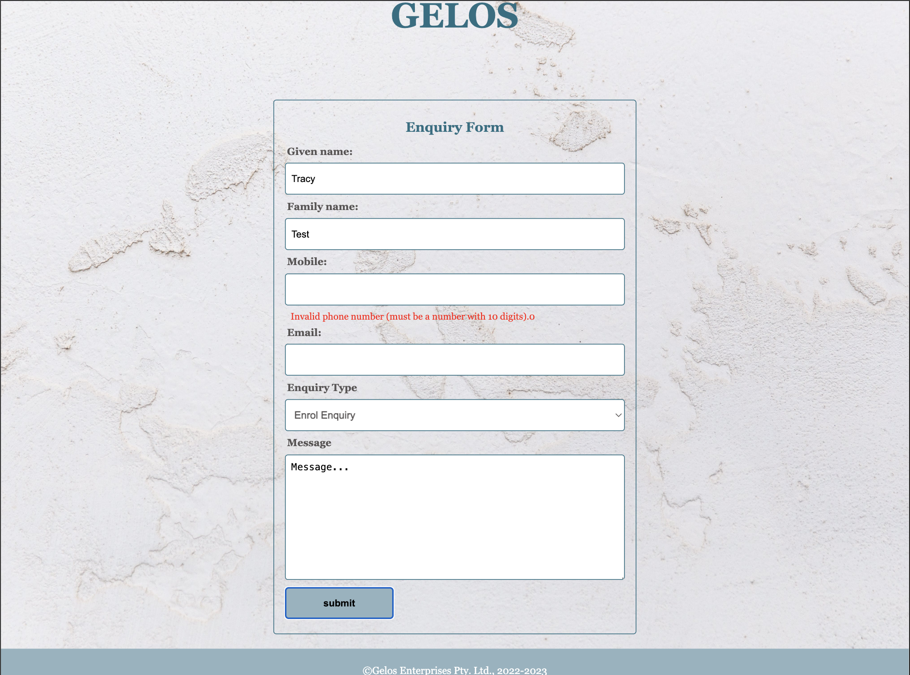

# Gelos Education Project


## Project Background

Originally developed as a student assessment for Certificate IV to demonstrate JavaScript skills, focusing on:
- Vanilla JavaScript implementation
- Interactive features and DOM manipulation
- Form validation
- Responsive design

Recent improvements after course completion:
- Implemented Web Components for better code organization
- Enhanced maintainability through component-based architecture

## Screenshots

### Desktop View

*Homepage on desktop showing the gallery and navigation*

### Mobile View
<div style="display: flex; flex-direction:row; justify-content: space-between; gap: 10px;">
    <div style="flex: 1; text-align: center; width: 375px;">
        
        <em>Mobile view with hamburger menu</em>
    </div>
    <div style="flex: 1; text-align: center; width: 375px;">
        
        <em>Mobile view with expanded navigation menu</em>
    </div>
</div>

### Form Validation

*Interactive form validation in action*

## Project Structure

```
├── index.html          # Home page
├── about.html          # About page
├── contact.html        # Contact information
├── enquiry.html        # Enquiry form
├── policies.html       # Policies page
├── qualification.html  # Qualifications page
├── style.css          # Main stylesheet
├── images/            # Image assets
├── js/
│   ├── components/    # Web components (recent addition)
│   ├── config.js      # Configuration
│   ├── validate.js    # Form validation
│   ├── gallery.js     # Gallery functionality
│   └── menu.js        # Navigation menu
```

## Technologies Used

- HTML5
- CSS3 with Flexbox and media queries
- Vanilla JavaScript
  - DOM manipulation
  - Form validation
  - Gallery functionality
  - Mobile menu toggle
- Web Components (recent enhancement)

## Features

### Navigation
- Responsive mobile menu
- Current page highlighting
- Smooth transitions

### Forms
- Client-side validation
- Touch-friendly input fields
- Responsive layout

### Gallery
- Interactive image slideshow
- Touch-friendly controls
- Responsive image scaling

## Responsive Design

The website is fully responsive with three breakpoints:
- Mobile: max-width 478px
- Tablet: 479px - 768px
- Desktop: 769px and above

## Browser Support

Compatible with modern browsers:
- Chrome (latest)
- Firefox (latest)
- Safari (latest)
- Edge (latest)
